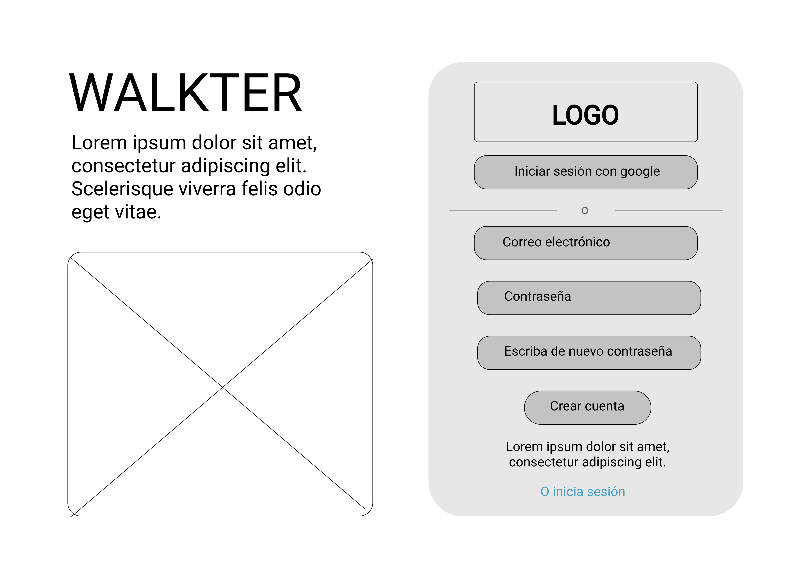

# WALKTER #

## Sobre la web ##

**Proyecto:** Social Network.

Esta es una red social orientada a usuarios de diferentes modos de transporte en la cual pueden realizar posts o 'reportes', relacionados con el estado del tránsito en el punto donde se encuentran, asi como mirar los reportes hechos por otros usuarios recientemente. 

Se pueden reportar diferentes tipos de eventos como Accidentes, Vias cerradas, Infracciones o Bloqueos.

El producto fue originalmente pensado como una red social donde se podia denunciar las infracciones cometidas por otros conductores, en la forma final que tomó llegamos a un proyecto en el cual estas infracciones son solo un tipo de reporte más.

Este proyecto toma importancia particular en situaciones como la vivida actualmente en Bogotá, en la cual el transporte es particularmente complicado tanto para Conductores Particulares, Usuarios de Transmilenio e incluso Biciusuarios y aplicaciones de movilidad si bien aportan información, no está actualizada en tiempo real con cosas tan variables como los bloqueos de vias y manifestaciones, tampoco con algunos arreglos y cierres de viales temporales. 

### Uso y Tutoriales ###

Puedes acceder a la versión web haciendo click [aqui](https://dsandovalm.github.io/BOG002-social-network/src/index.html)

## Sobre el diseño ##

### Prototipos ###

#### Baja fidelidad ####

- Sign in

- Sign up

- Inicio: mapa. Publicaciones en pop ups

- Perfil de usuario

- Configuración

- Creación de Publicaciones

**Feedback recibido**
- Se redujo el numero de pantallas. Se cambió el flujo de la creación de posts al eliminar la cámara.

#### Alta fidelidad ####
- Sign in
- Sign up
- Inicio: mapa
- Modal: publicación
- Perfil de usuario

## Sobre el código

En este proyecto se utilizó la base de datos ofrecida por Google, Firebase, de la cual se utilizó la Autenticación _firebase.auth()_ para registros e inicios de sesión, la base de datos noSQL Firestore _firebase.firestore()_ para guardar datos de posts y usuarios y el Storage _firebase.storage_ para guardar las imagenes de los posts.
